# **PENETRATION TESTING REPORT**

## FOOTPRINTING & NETWORK SCANNING PHASES

W2-PM-FINAL | CYBERSECURITY |  NETWORKWALKS

| **Penetration Tester** /(Cybersecurity Professional) | Jeffrey Obi |
| :---- | :---- |
| **Program/Batch** | B083-Networkwalks |
| **Date** | 23 September, 2026 |
| **Modules completed** | W2-PM1 (Multiple Kali Tools) W2-PM2 (Google Hacking Database) W2-PM3 (Maltego) W2-PM4 (theHarvester) W2-PM5 (Zenmap Scanning) |
| **Client/Target** | 1\. Networkwalks (secured written permission already) 2\. My own local LAN Network |
| **Permission secured from client?** | Yes |
| **Phases covered** | Phase 1: Reconnaissance & Footprinting; Phase 2: Scanning |
| **Reports (PDF)** |  .pdf)  |

# **1\. Liability Disclaimer**

All activities were performed only on the systems & devices where I had secured written permission and on the devices, networks and systems that I own myself. This project was executed for education and research purposes only. Do not use anything from here to break the law. The instructor, the authors and Networkwalks are not responsible for what you do with this knowledge. Every action you take is your own responsibility. Misuse can lead to criminal charges, heavy fines, loss of your job and a permanent record. In most countries unauthorized access is a crime even when nothing is damaged.

# **2\. Introduction**

This report covers footprinting the **networkwalks.com** domain using multiple Kali Linux tools and scanning my own local network with Zenmap. One module covers the footprinting phase and the other covers the scanning phase, so together they show how an attacker moves from gathering public information to mapping live hosts on a network. It is the Week 2 part of my ongoing internship program at Networkwalks.

All commands were run in Kali Linux (footprinting) and on a Windows PC with Zenmap installed (scanning). Every step below includes the exact command used, the result I observed, a screenshot as evidence, and a short note on why the finding matters from an attacker's point of view.

# **3\. Tools Used**

The table below lists each tool used in this report and its purpose.

| Tool | Purpose |
| :---- | :---- |
| **Kali Linux & Windows** | Operating systems used for reconnaissance activities |
| **WHOIS** | Find domain registration details (owner, dates, name servers). |
| **whatweb** | Fingerprint web technologies (server, CMS, plugins, IP). |
| **nslookup** | Resolve the domain name to its IP address using DNS. |
| **curl \-I** | Read the HTTP response headers of the website. |
| **wafw00f** | Detect whether a Web Application Firewall protects the site. |
| **dnsrecon** | Enumerate all DNS records (NS, MX, SPF, TXT, SRV). |
| **Zenmap (Nmap GUI)** | Scan the local subnet to find live hosts, IPs and MAC addresses. |
| **Windows CMD** | Local IP and MAC address identification |

# **4\. Activities Performed**

## **4.1 Footprinting & Reconnaissance**

I performed reconnaissance against the networkwalks.com domain using six Kali Linux tools: **WHOIS, WhatWeb, Nslookup, Curl, Wafw00f and DNSRecon.** Each tool was used to collect a different type of information about the target.

### **4.1.1 WHOIS**

First, I used **WHOIS** to obtain publicly available domain registration information and identify the domain’s name servers (**NS6135.HOSTGATOR.COM** & **NS6136.HOSTGATOR.COM**). The results provided information about the domain registration and hosting infrastructure.

### **4.1.2 WHATWEB**

I then used **WhatWeb** to identify technologies used by the website. The results identified **WordPress 7.1.2** and **WP Download Manager 3.3.58,** along with other information exposed by the website.

### **4.1.3 NSLOOKUP**

Using **Nslookup,** I resolved the domain name to its IP address. The provided result identified **192.232.216.135.**

### **4.1.4 CURL \-I**

I used Curl with the \-I option to inspect the HTTP response headers. This provided additional information about the web application and exposed the WordPress REST API endpoint, **/wp-json/.**

#### **4.1.5 WAFW00F**

Next, I used **Wafw00f** to determine whether a Web Application Firewall was protecting the website. The result identified **ModSecurity (SpiderLabs)** web application firewall.

**4.1.6 DNSRECON**

I used **DNSRecon** to enumerate DNS records. The results provided information relating to name servers, mail servers, SPF/TXT records, service records and DNS software information.

### **4.1.7 GOOGLE HACKING DATABASE**

I used the Google Hacking Database to explore reported Google dorks which were used to locate open/exposed resources and servers. I confirmed and documented 10 exposed cameras. I also used Google dorking techniques to find and confirm links to 10 exposed mathematics books.

### **4.1.8 MALTEGO**

I installed and configured **Maltego** to reveal the email address **(info@networkwalks.com)** related to the **networkwalks.com** domain.

### **4.1.9 THEHARVESTER**

Returning to the Kali VM, I used the **theHarvester** to find subdomains for **microsoft.com.** I first conducted a scan searching the Baidu database with a result limit of 1,000. Then I conducted another scan searching all databases with a result limit of 50\.

## **4.2 Scanning** 

### **4.2.1 ZENMAP**

For the second module, I used **Zenmap** to perform a network discovery on my local network. Using the tool, I identified my local IP address and subnet, live hosts, their IP addresses and MAC addresses. I also generated a network topology.

I first used the Windows **ipconfig** command to identify my local IP address and LAN subnet. I then entered the subnet into Zenmap and conducted a **Ping Scan** to identify active hosts.

The example results identified eight (8) live hosts. Here are their IP addresses:

* 192.168.1.1  
* 192.168.1.2  
* 192.168.1.5  
* 192.168.1.6  
* 192.168.1.8  
* 192.168.1.10  
* 192.168.1.13 (my laptop)  
* 192.168.1.15

The results also included MAC addresses. Only 7 MAC addresses were included in the results. My machine was excluded in the scan, so I manually added it to the following list.

* 20:08:89:23:XX:XX  
* E8:88:6C:43:XX:XX  
* 48:5C:2C:5E:XX:XX  
* 2A:09:6F:0D:XX:XX  
* BC:09:B9:59:XX:XX  
* F8:34:41:59:XX:XX  
* 20:79:18:5F:XX:XX (my laptop)  
* C6:17:2A:62:XX:X

After completing the scan, I opened the **Topology** tab in Zenmap, enabled the legend and saved the network topology in PDF format as was required.

**Note:** The actual subnet, number of hosts and addresses should be replaced with the results from my own network when submitting the report.

# **5\. Risk Analysis / Impact**

Based on the information collected during the footprinting and network scanning activities, I identified the following potential risks.

| \# | Risk / Finding | Evidence / Observation | Potential Impact | Risk Level |
| :---: | ----- | ----- | ----- | :---: |
| 1 | Web technology information exposed | WhatWeb identified WordPress and WP Download Manager | Attackers may use exposed technology/version information to identify software requiring further security review | **Medium** |
| 2 | Server IP address identifiable | Nslookup resolved the domain to 192.232.216.135 | Provides information about the network location of the web service | **Low** |
| 3 | HTTP technical information exposed | Curl returned HTTP response headers and exposed /wp-json/ | May assist technology fingerprinting and further enumeration | **Low** |
| 4 | WAF technology identifiable | Wafw00f identified ModSecurity (SpiderLabs) | Reveals information about the web application’s security architecture | **Low** |
| 5 | DNS infrastructure information exposed | DNSRecon identified DNS, mail and service-related records | DNS information can help build a broader infrastructure profile | **Medium** |
| 6 | Private media exposed | Google Hacking Database identified exposed IP cameras and web servers | Unsecure private information may be stolen by attackers and online pirates. | **Medium** |
| 7 | Email addresses identifiable | Maltego identified email addresses related to a target domain | Email addresses related to the target may be collected and targeted in social engineering attacks | **Medium** |
| 8 | Subdomains identifiable | theHarvester identified numerous subdomains of a target domain | Reveals known subdomains which may be used to orchestrate URL-based attacks and conduct further reconnaissance | **Low** |
| 9 | Multiple live hosts visible on local network | Zenmap identified four live hosts in the example network | Unknown or unauthorized devices may potentially be present on a network | **Medium** |

The risks above are observations from the footprinting and scanning exercises, not confirmed vulnerabilities.

The practical exercises primarily involved information gathering and host discovery. No exploitation or vulnerability validation was performed as part of these two modules.

Therefore, the presence of information such as a software version, IP address or DNS record does not by itself mean that the system is vulnerable. Further authorized security testing would be required to confirm any actual vulnerability.

# **6\. Recommendations**

Based on the observations from these activities, I recommend the following security improvements:

1. **Review publicly exposed technology information**  
   Organizations should regularly review what information about their web technologies, CMS and plugins is publicly visible.

2. **Keep software updated**  
   CMS platforms, plugins and other web technologies should be regularly updated and reviewed against current security advisories.

3. **Review HTTP headers**  
   HTTP response headers should be reviewed to determine whether unnecessary technical information is being exposed.

4. **Review DNS records regularly**  
   DNS records should be checked periodically to ensure that only required information and services are publicly exposed.

5. **Properly configure and monitor the WAF**  
   Keep the WAF (ModSecurity) enabled and tuned, since it already blocks naive attacks.

6. **Perform regular internal network discovery**  
   Organizations should periodically scan their own networks to identify active devices.

7. **Investigate unknown devices**  
   Any unexpected device discovered during network scanning should be investigated and verified.

8. **Maintain network documentation**  
   Network topology and device information should be documented and updated regularly.

9. **Perform security testing with authorization**  
   Reconnaissance and scanning should only be performed against systems and networks where appropriate authorization has been provided.

# **7\. Conclusion**

During Week 2 of my Cybersecurity & Ethical Hacking internship, I completed practical activities covering footprinting, reconnaissance and network scanning.

In the footprinting module, I used six Kali Linux tools to collect information about the target domain. I learned how WHOIS can provide domain information, WhatWeb can identify web technologies, Nslookup can resolve domain names, Curl can inspect HTTP headers, Wafw00f can identify a WAF, DNSRecon can provide additional DNS information, the Google Hacking Database can provide search queries for revealing exposed resources and data, Maltego can reveal email addresses related to a domain and theHarvester can identify sub-domains  related to a domain.

In the network scanning module, I used Zenmap to identify my local network configuration and discover active hosts. I also collected IP and MAC address information and created a network topology.

The exercises showed me that information gathering is an important part of cybersecurity. Even before attempting to exploit a system, a security professional can learn a significant amount about an environment by carefully analyzing publicly available information and network responses.

I also learned that technical findings should be documented clearly. A good cybersecurity report should explain what was performed, what was discovered, what the observation means, what risk it may create, and what can be done to reduce that risk. Identifiable and sensitive information about personal devices and private information were obscured in texts and images in this report for security considerations.

Finally, I learned that reconnaissance and scanning must always be performed within an authorized scope. These activities were completed as part of the assigned educational cybersecurity lab.

# **8\. Evidence Collected**

## **Module 1: Footprinting**

1. ### **whois**

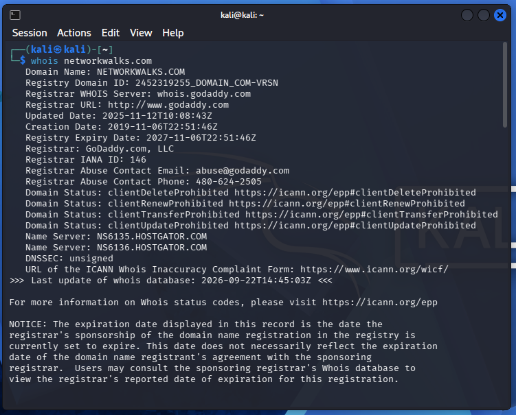

*Figure 1: Screenshot showing the **whois** command return in the Terminal CLI.*

2. ### **whatweb**

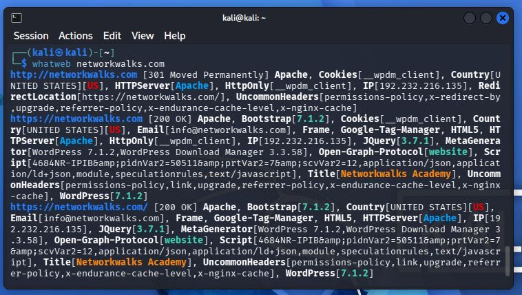

*Figure 2: Screenshot showing the **whatweb** command return in the Terminal CLI.*

3. ### **nslookup**

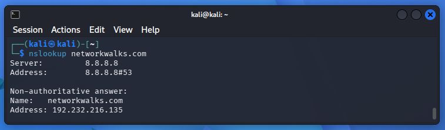

*Figure 3: Screenshot showing the **nslookup** command return in the Terminal CLI.*

4. ### **curl \-I**

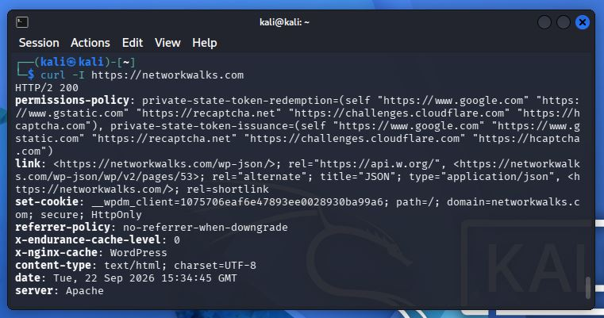

*Figure 4: Screenshot showing the **curl \-I** command return in the Terminal CLI.*

5. ### **wafw00f**

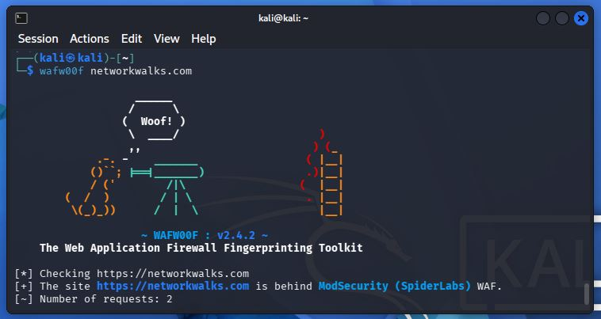

*Figure 5: Screenshot showing the **wafw00f** command return in the Terminal CLI.*

6. ### **DNSrecon**

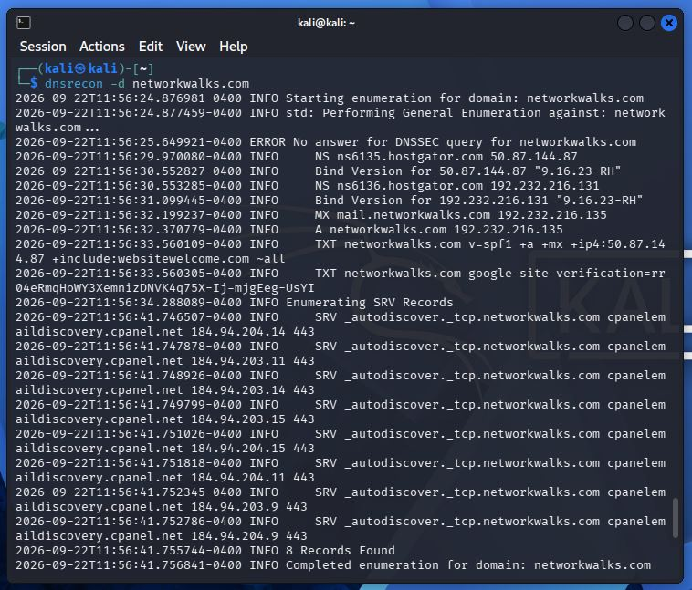

*Figure 6: Screenshot showing the **DNSrecon** command return in the Terminal CLI.*

7. ### **Google Hacking Database**

10 live vulnerable security camera links, exposed & accessible from the Internet.:

| No. | Link | Relevant Dork | Username /Password  (if any) |
| :---: | :---: | :---: | :---: |
| **1** | `https://80.152.138.183/ViewerFrame?Mode=Motion&Language=0` | `inurl:/ViewerFrame? intitle:"Network Camera NetworkCamera"` | `No` |
| **2** | `https://webcam.io/users/sign_in` | `intitle:"webcam" inurl:login` | `Yes` |
| **3** | `http://95.255.183.164:8080/multi.html` | `intitle:"WEBCAM 7"-inurl:/admin.html` | `No` |
| **4** | `http://62.202.21.238:8081/` | `intitle:"WEBCAM 7"-inurl:/admin.html` | `Yes` |
| **5** | `http://109.233.191.130:8080/` | `intitle:"webcamXP 5" inurl:8080 'Live'` | `No` |
| **6** | `http://85.93.53.175:8080/home.html` | `intitle:"webcamXP 5" inurl:8080 'Live'` | `No` |
| **7** | `http://193.77.49.122/` | `intitle:"IP CAMERA Viewer" intext:"setting \| Client setting"` | `No` |
| **8** | `http://99.114.240.169:8080/` | `intitle:"webcam 7" inurl:'/gallery.html'` | `No` |
| **9** | `http://176.106.38.115:82/Pages/login.htm?0.17693531443781252` | `intitle:"NoVus IP camera" -com` | `Yes` |
| **10** | `https://www.skylinewebcams.com/webcam/italia/lazio/roma/fontana-di-trevi.html` | `inurl:webcam site:skylinewebcams.com inurl:roma` | `No` |

10 listings which contain downloadable mathematics ebooks in PDF format:

| No. | Link | Relevant Dork | Username /Password  (if any) |
| :---: | :---: | :---: | :---: |
| **1** | https://www.jsoftware.com/books/pdf/ | intitle:index.of "parent directory" mathematics pdf | No |
| **2** | https://ochicken.net/library/Mathematics/ | intitle:index.of "parent directory" mathematics pdf | No |
| **3** | https://www.unm.edu/\~megrad/Math/ | intitle:index.of "parent directory" mathematics pdf | No |
| **4** | http://erewhon.superkuh.com/library/Math/ | intitle:index.of "parent directory" mathematics pdf | No |
| **5** | https://www.aetkin.com/files/Math%20150%20Calculus%20I/Advanced%20Calculus%20Textbook/ | intitle:index.of "parent directory" advanced mathematics pdf | No |
| **6** | https://lira.epac.to/DOCS-TECH/Math/Engineering%20and%20Applied/ | intitle:index.of "parent directory" advanced mathematics pdf | No |
| **7** | https://education.giakonda.org.uk/Maths/ | intitle:index of "parent directory" books math pdf | No |
| **8** | https://www.math.uchicago.edu/\~may/BOOKS/ | intitle:index of "parent directory" books math pdf | No |
| **9** | https://isidore.co/misc/Physics%20papers%20and%20books/Mathematics/ | intitle:index of "parent directory" books math theory pdf | No |
| **10** | https://math.uchicago.edu/\~margalit/repthy/ | intitle:index of "parent directory" books math theory pdf | No |

8. ### **Maltego**

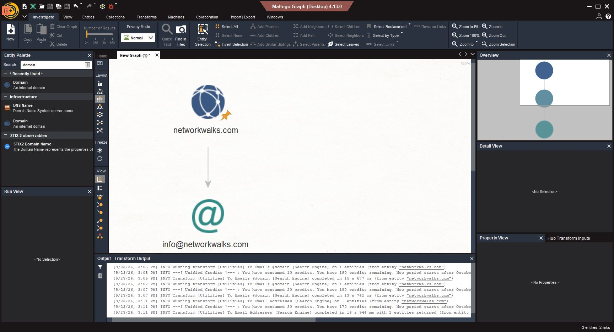

*Figure 7: Screenshot of the **Maltego** interface showing the returned email results.*

9. ### **theHarvester**

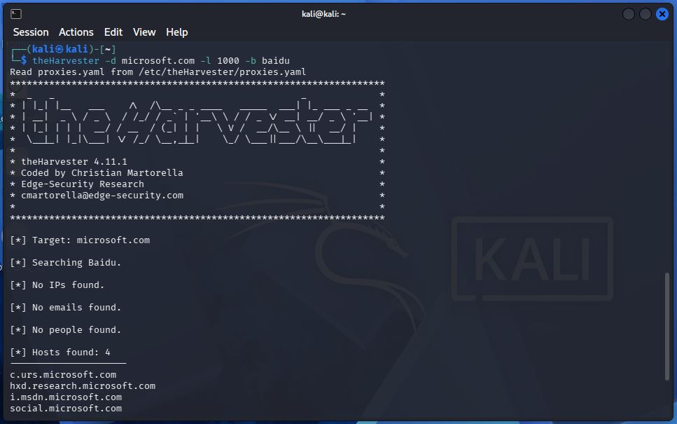

*Figure 8: Screenshot of the **Terminal** interface showing the* email IDs & sub-domains related to **microsoft.com** using the **theHarvester** tool to search **Baidu,** with the **result limit set to 1000\.**

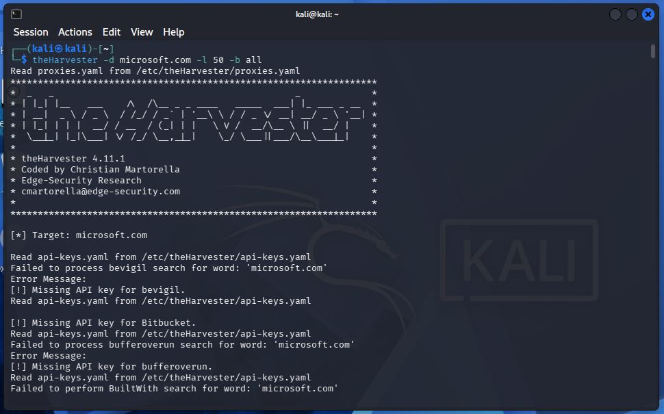

*Figure 9: Screenshot of the **Terminal** interface showing the* email IDs & sub-domains related to **microsoft.com** using the **theHarvester** tool to search with **all sources,** with the **result limit set to 50\.**

## **Module 2: Scanning**

1. ### **Zenmap**

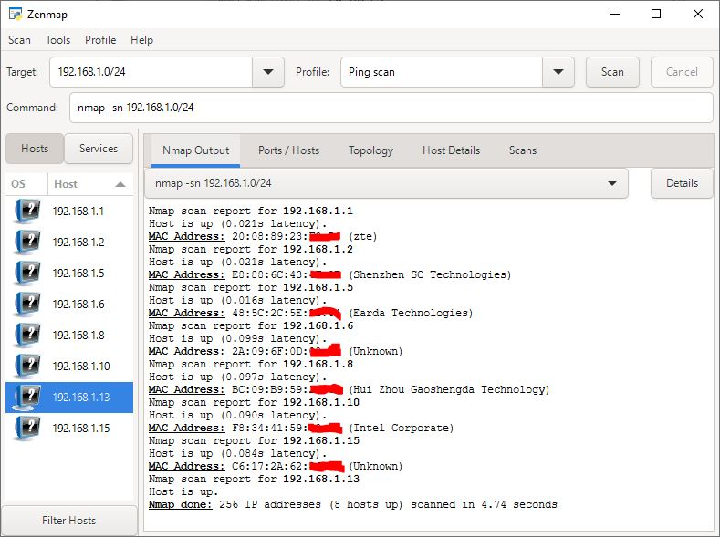

*Figure 10: Screenshot of the **Zenmap** interface showing the results of the local network scan.*

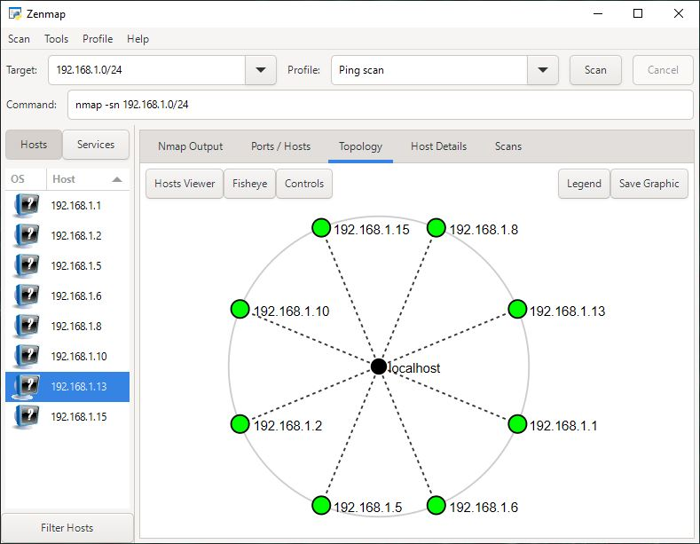

*Figure 11: Screenshot of the **Zenmap** interface showing the topology of the local network.*

**Author**  
Jeffrey Obi  
Cybersecurity Professional B083

LinkedIn: [https://www.linkedin.com/in/jeffreyoo/](https://www.linkedin.com/in/jeffreyoo/) 

---

**📌 Project Information**  
Program Name: Cybersecurity program at Networkwalks | Week: 02 | Repository: GitHub

